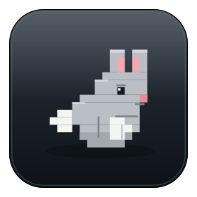

[](https://github.com/bttnns/harvey/actions/workflows/ci.yml)

# harvey (`harv`)

A tiny CLI that runs a command inside a container, against your real files, then throws
the container away. Your dev toolchain (and your AI agents) live in the image, not on
your machine.

- **Keep your machine clean** - toolchains live in one image, not on your host.
- **No Dockerfile to write** - point it at any image and run.
- **Throwaway, but your work stays** - every dev run is `--rm` with your `$HOME`
  mounted at the same path by default, so files, dotfiles, and build caches persist.
  Opt out with `home: false`; `harv sandbox` never mounts `$HOME`.
- **One config, every runtime** - the same `.harvey.yaml` runs natively on Apple
  `container` (macOS) and Podman (Linux).
- **Sandbox AI agents** - `harv sandbox` runs an agent with no `$HOME` and no network.

```sh
harv                       # interactive shell in a throwaway container
harv go test ./...         # run one command, then discard the container
harv sandbox claude        # run an AI agent boxed in: no $HOME, no network
```

## Why

No existing tool covers this exact combination: Dev Containers are workspace-centric
and have no Apple `container` support; Distrobox/Toolbx are Linux-host only with
persistent boxes; Apple's `container machine` is macOS-only and persistent. `harv` is
the thin layer that unifies throwaway, `$HOME`-mounted, config-driven runs across both
runtimes. It is a small wrapper over `<runtime> run` built with
[cobra](https://github.com/spf13/cobra): config in `internal/config`, runtimes in
`internal/runtime`, commands in `cmd/`. No daemon, no persistent-container lifecycle.

## Install

Build the `harv` binary from a clone onto your PATH:

```sh
git clone https://github.com/bttnns/harvey.git ~/Dev/harvey
cd ~/Dev/harvey && go build -o ~/.local/bin/harv .
```

> `harv` calls your container runtime on the host, so build it for the host OS. If you
> compile inside a Linux container, cross-compile for the host, e.g.
> `GOOS=darwin GOARCH=arm64 go build -o harv .`.

## Quickstart

```sh
harv                       # interactive login shell in a throwaway container
harv go test ./...         # run one command in a throwaway container
harv 'npm ci && npm test'  # quote to chain shell commands
harv serve --name app -p 3000 npm run dev -- -H 0.0.0.0 -p 3000   # browser-facing server
harv enter                 # persistent "pet" container for this dir, reused across runs
harv doctor                # check runtime, image, config, and platform
```

Copy [`example.harvey.yaml`](example.harvey.yaml) to `.harvey.yaml` in a project (or
to `~/.config/harvey/config.yaml` for a global default) and edit `image:`. That is the
only required key. See the [usage guide](docs/usage.md) for the full command set.

## Sandbox an agent

`harv sandbox` inverts the permissive dev default: the agent gets the **same image**
(so it keeps the toolchain) but **none of your host**: only the project is mounted, the
network is off, the root filesystem is read-only, and capabilities are dropped. So it
can't read your SSH keys or cloud creds, write outside the project, or phone home.

```sh
harv sandbox claude        # run an AI coding agent, contained
harv sandbox 'npm test'    # run untrusted scripts, contained
```

Because the container is the boundary, you can safely run an agent in its most
autonomous mode and inject only the key it needs. See [docs/sandbox.md](docs/sandbox.md)
for the threat model, per-runtime support, and per-agent recipes.

## Documentation

- **[Usage guide](docs/usage.md)** - configure, every command, servers, dev vs sandbox.
- **[Sandboxing AI agents](docs/sandbox.md)** - threat model, per-runtime support, recipes.
- **[Spec](docs/spec.md)** - architecture, full config schema, command and driver reference.
- **[Status](docs/status.md)** - what works today and what's next.

## License

[AGPL-3.0](LICENSE).

## In memory

Named for Harvey, my first dog, a beagle, and the best protector and friend I could
have asked for. He loved Fred, his stuffed rabbit, and carried him around.
